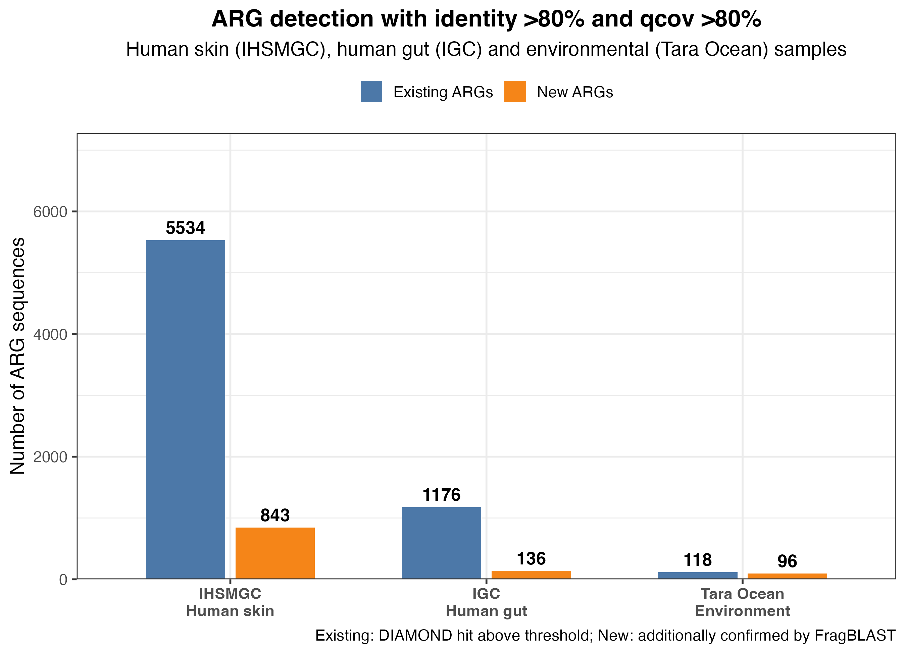
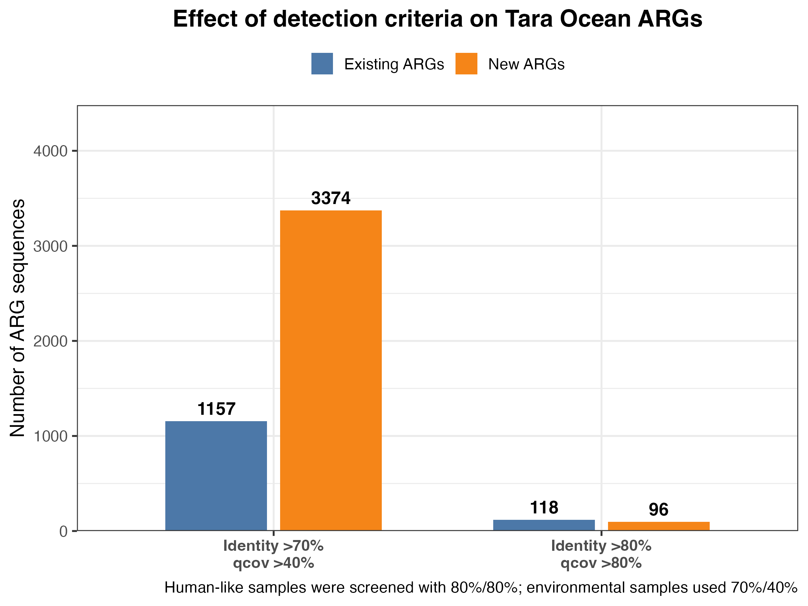

# FragBLAST

FragBLAST is a fragment-level protein alignment tool for discovering
functional gene fragments, with antibiotic resistance genes (ARGs) used here
as the case study. It is not limited to ARGs and can be applied to other
functional gene families when a curated reference database is available.

The workflow combines DIAMOND for fast candidate retrieval with a local
re-alignment step (parasail / Smith–Waterman) that enumerates maximal
high-identity fragments along a single alignment path.

## Why FragBLAST?

DIAMOND and BLAST report whole HSPs (high-scoring pairs, i.e. the local
alignment segments between a query and a subject that are reported by the
search). Hard thresholds such as "identity > 80% and query coverage > 80%"
are then applied to averages computed over each entire HSP.

An HSP is composed of columns of the query-subject alignment. Percent
identity is the fraction of identical columns within the HSP, and query
coverage (qcov) is defined relative to the **full query length**, not the
length of the HSP or of an internal sub-segment. A fragment cannot have
higher query coverage than the HSP that contains it.

Because identity is averaged over the whole HSP, a long HSP with modest
overall identity can hide an internal region whose identity is much higher.
For example, an HSP with approximately 75% identity and 90% query coverage
may contain an internal fragment with > 80% identity and > 80% query
coverage. Standard hard-threshold filtering only evaluates the average over
the whole HSP and never exposes that embedded fragment.

FragBLAST addresses this by:

1. using DIAMOND to find candidate query-subject pairs;
2. re-aligning each candidate pair with full local alignment (BLOSUM62,
   affine gaps);
3. enumerating maximal contiguous fragments of the alignment path whose
   identity, query coverage and subject coverage exceed user-defined
   thresholds;
4. reporting those fragments as additional candidate functional genes.

The underestimation risk is higher when a lenient threshold is used: long
HSPs with mixed identity are more likely to be accepted as whole alignments,
hiding the high-identity segment inside them.

## Datasets and ARG results

The workflow was applied to three protein/gene catalogs:

| Dataset | Sample type | Rule used in this study |
|---|---|---|
| IHSMGC | Human skin microbiome gene catalog | identity > 80%, qcov > 80% |
| IGC | Human gut microbiome gene catalog | identity > 80%, qcov > 80% |
| Tara Ocean | Environmental (Tara Oceans expedition) proteins | identity > 70%, qcov > 40% |

Human samples (IHSMGC and IGC) were screened with the strict 80%/80% rule.
Tara Ocean is an environmental dataset, where a 70% identity / 40% qcov
combination is commonly used for ARG identification. **Results obtained with
different thresholds should not be compared directly.**

To make Tara Ocean comparable with the human samples, the same Tara Ocean
DIAMOND output was additionally analyzed with the 80%/80% rule.

### ARG counts

For each dataset, "Existing ARGs" are the DIAMOND hits that already pass the
hard threshold, and "New ARGs" are the additional sequences confirmed by
FragBLAST from the remaining candidate pool.

| Dataset | Threshold | Existing ARGs | New ARGs |
|---|---|---:|---:|
| IHSMGC (human skin) | 80% / 80% | 5,534 | 843 |
| IGC (human gut) | 80% / 80% | 1,176 | 136 |
| Tara Ocean (environment) | 70% / 40% | 1,157 | 3,374 |
| Tara Ocean (environment, re-analyzed) | 80% / 80% | 118 | 96 |

When Tara Ocean is re-analyzed with the same 80%/80% rule as the human
catalogs, the number of detected ARGs drops sharply, illustrating how strongly
the threshold choice affects both detection and interpretation.

## Repository layout

```text
.
├── fragblast/                  # core fragment enumeration library
│   ├── align.py                # parasail local alignment wrapper
│   ├── segments.py             # maximal fragment enumeration
│   └── cli.py                  # command-line interface
├── scripts/
│   ├── arg_pipeline.py         # DIAMOND + FragBLAST ARG workflow
│   └── plot_arg_comparison_v2.R  # ggplot2 summary figures
├── tests/                      # pytest suite
├── figures/                    # English summary figures
└── environment.yml             # conda environment
```

## Installation

The recommended setup uses conda:

```bash
conda env create -f environment.yml
conda activate fragblast
```

Install the parasail Python bindings. The 1.3.4 source distribution requires a
`glibtoolize` alias on macOS:

```bash
mkdir -p .build-bin
ln -sf "$(command -v libtoolize)" .build-bin/glibtoolize
ln -sf "$(command -v libtool)" .build-bin/glibtool
PATH="$PWD/.build-bin:$PATH" python -m pip install parasail==1.3.4
```

Install DIAMOND if it is not already available:

```bash
conda install -c bioconda diamond
```

Run the test suite:

```bash
python -m pytest
```

## Usage

### FragBLAST command line

```bash
python -m fragblast \
  --query query.fa \
  --db database.fa \
  --ident 80 \
  --cov 80 \
  --coverage_sequence query \
  --out hits.tsv
```

Output columns:

`query_id  subject_id  q_start  q_end  s_start  s_end  aligned_len  identity  qcov  scov`

### End-to-end ARG pipeline

```bash
python scripts/arg_pipeline.py \
  --query data/query.fa \
  --db data/SARG.fasta \
  --outdir results \
  --ident 80 \
  --cov 80 \
  --coverage_sequence query \
  --threads 4 \
  --fragblast-threads 4 \
  --max-subjects-per-query 3
```

The pipeline derives all internal settings from the requested `--ident` and
`--cov` thresholds. The candidate screen requires:

1. the coverage of the relevant sequence(s) to be strictly above `--cov`
   (`--coverage_sequence` chooses query, subject, or both);
2. `pident * coverage > ident * cov`, which is a necessary condition for any
   embedded fragment that passes both hard thresholds.

DIAMOND pre-filters are generated automatically from those thresholds and do
not need to be supplied by the user.

The pipeline writes:

- `solid_ARGs.fasta`: DIAMOND hits that pass the hard threshold;
- `potential_ARGs.fasta`: remaining candidates that satisfy both candidate
  conditions above;
- `new_ARGs.fasta`: candidates additionally confirmed by FragBLAST;
- `arg_pipeline_summary.txt`: sequence counts and summary statistics.

## Figures





## References

- Li, Z. et al. Characterization of the human skin resistome and
  identification of two microbiota cutotypes. Microbiome 9, 47 (2021).
- Li, J. et al. An integrated catalog of reference genes in the human gut
  microbiome. Nature Biotechnology 32, 834–841 (2014).
- Delmont, T. O. et al. Nitrogen-fixing populations of Planctomycetes and
  Proteobacteria are abundant in surface ocean metagenomes. Nature
  Microbiology 3, 804–813 (2018).
- Buchfink, B., Reuter, K. & Drost, H.-G. Sensitive protein alignments at
  tree-of-life scale using DIAMOND. Nature Methods 18, 366–368 (2021).
